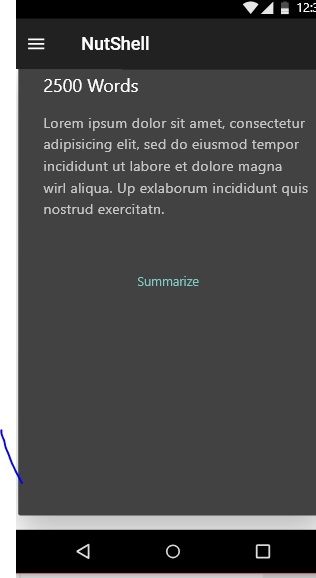
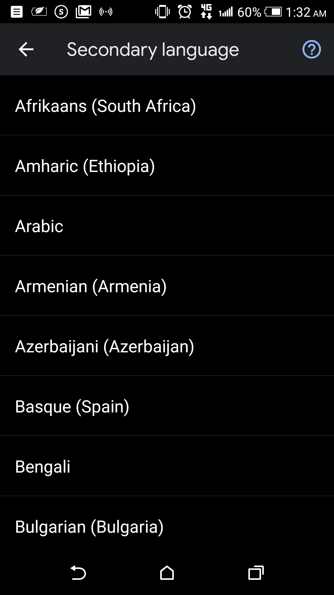
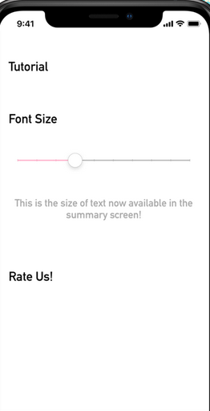

# IN A NUTSHELL
In our everyday lives it is common to be faced with the need to summarize information. Whether we are studying for a test, trying to catch up with news, or reading blogs and articles on the internet it would be very helpful if we could compress all that information into just a few paragraphs without losing meaning or context. Furthermore, with all the information we are overwhelmed with on a daily basis, we would find a summarizing tool to be valuable in helping us grasp the gist of huge source of text.

 Nutshell is a mobile application that leverages on device machine learning to accurately summarize information. Users can import a document or copy paste text into the Nutshell text summarizer and the app will deliver an accurate summary in a compressed form.
With support of over 100 languages, Nutshell helps you shorten a set of paragraphs to the most relevant sentences containing key points you should be aware of. It is as simple as it sounds, copy text from your favorite source or copy the link directly, open the app and start reading!
All summarization happens on-device and doesn't require internet access, unless you're using the link to summarize, then you need internet just to get the text.

The app uses abstractive summary to achieve its goals. Firstly, we will perform data processing which will aid in filtering unnecessary characters or sentences from the data set, tokenizing articles into words and creating word embedding’s using Tensorflow lite to represent the words in a numeric manner. The architecture of the model will involve a sequence to sequence model which is available on Tensor flow lite. The data will then be trained and tested on google cloud AI platform.

                  

# My Summarized Story
Let me tell you a story of a boy who set out to write algorithms to make consuming information easier by summarizing text automatically using algorithms. I started writing android apps in 2015 when I started college. I am currently a final year Student taking Electrical and Electronic Engineering at Jomo Kenyatta University. I have interest in machine learning and Mobile app development and I have done a couple of projects as well as gotten invitations to attended conferences on AI including Deep Learning Indaba held in Nairobi this year. I am currently a Google Africa scholar and facilitator awaiting an Associate Android developer certification. More about me can be found on my Linkedin as well as Github. 
I have worked on various project on Machine learning and android app development on an individual level and as part of a team:
Lead developer of Teketeke – A mobile application that leveraged on device machine learning to perform barcode scanning for a self-checkout in supermarkets
•	Research Assistant at Jomo Kenyatta University (Department of Electrical and Electronic Engineering)- I am currently building an Optimal Design of Power Scheduling/ load shedding using Artificial Neural Network in an Isolated Power System.
•	Second runners up: Zindi Hackathon (Nairobi)-Traffic jam: Predicting people’s movement in Nairobi
•	Technical mentor of the winning team in Teens in AI hackathon held during the deep learning Indaba in Nairobi

